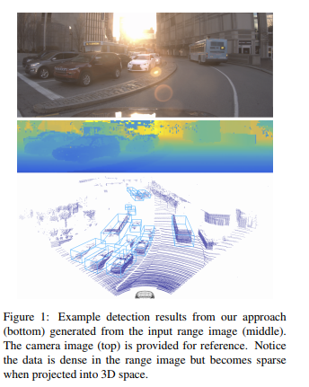
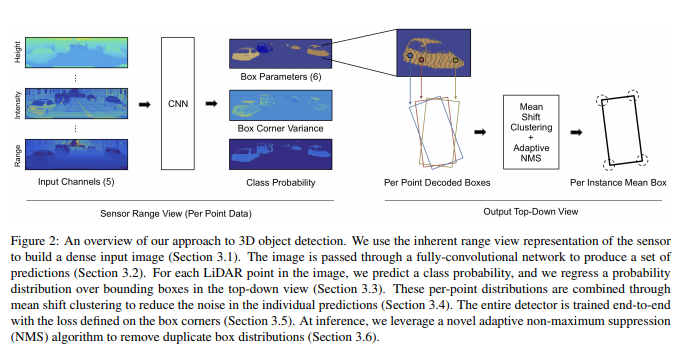
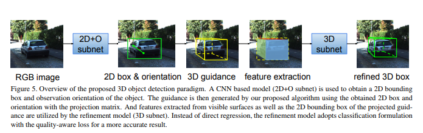
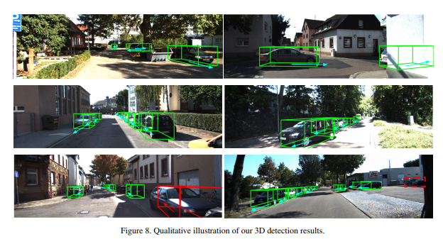
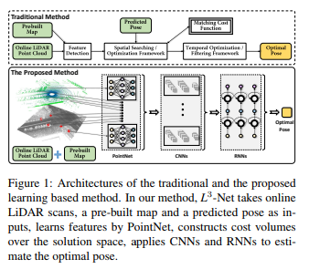
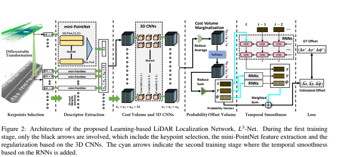
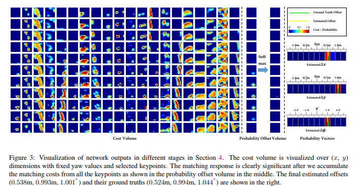
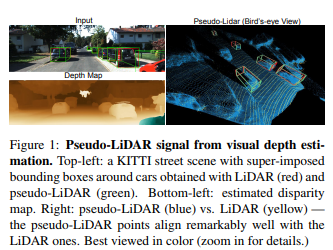
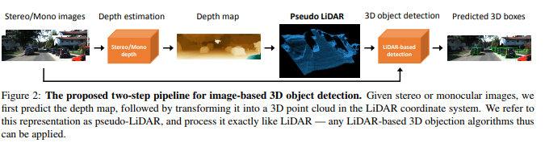
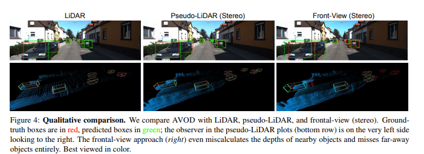

[LaserNet: An Efficient Probabilistic 3D Object Detector for Autonomous Driving](https://arxiv.org/abs/1903.08701)，KITTI BEV（Bird's Eye View），LiDAR解决方案  
讨论 Issue:  
作者：Gregory P. Meyer,Ankit Laddha,Eric Kee,Carlos Vallespi-Gonzalez,Carl K. Wellington  
 团队：Uber ATG   
摘要：在本文中，我们介绍了LaserNet，一种用于自动驾驶的LiDAR数据的3D对象检测的计算有效方法。效率来自在传感器的原生范围视
图中处理LiDAR数据，其中输入数据自然紧凑。在范围视图中操作涉及众所周知的学习挑战，包括遮挡和尺度变化，但它还基于如何捕获
传感器数据来提供上下文信息。我们的方法使用完全卷积网络来预测每个点的3D Box上的多模态分布，然后它有效地融合这些分布以生成
每个对象的预测。实验表明，将每个检测建模为分布而不是单个确定性框导致更好的整体检测性能。基准测试结果表明，这种方法的运行
时间明显低于其他最新的检测器，并且在具有足够数据的大型数据集上进行比较时，它可以实现最先进的性能，以克服视图范围内训练的挑战。 

  
  

---
[GS3D: An Efficient 3D Object Detection Framework for Autonomous Driving](https://arxiv.org/abs/1903.10955),3D目标检测   
讨论 issue:   
作者：Buyu Li, Wanli Ouyang, Lu Sheng, Xingyu Zeng, Xiaogang Wang  
研究结构：香港中文大学、悉尼大学、商汤科技  
摘要：我们在自动驾驶的场景中提出了基于单个RGB图像的高效3D对象检测框架。我们的努力是在2D图像中提取底层3D信息并确定对象的
精确3D边界框而没有点云或立体数据。利用现成的2D物体探测器，我们提出了一种巧妙的方法来有效地为每个预测的2D盒子获得粗长方体。
粗长方体具有足够的精度来指导我们通过细化来确定对象的3D盒子。与先前仅使用从2D边界框提取的特征进行盒子细化的最先进方法相比，
我们通过使用可见表面的视觉特征来探索对象的3D结构信息。表面的新特征用于消除仅使用2D边界框带来的表示模糊的问题。此外，
我们研究了3D盒子细化的不同方法，并发现具有质量意识损失的分类公式具有比回归更好的性能。在KITTI基准测试中，我们的方法优于
当前基于单个RGB图像的3D对象检测的最先进方法。 
 
  
  
  
---
[L3-Net: Towards Learning based LiDAR Localization for Autonomous Driving](https://songshiyu01.github.io/pdf/L3Net_W.Lu_Y.Zhou_S.Song_CVPR2019.pdf),定位  
讨论 issue:  
作者: Weixin Lu、Yao Zhou、 Guowei Wan、Shenhua Hou、Shiyu Song
研究结构：百度自动驾驶事业部
摘要：我们展示了L3-Net--一种基于学习的新型LiDAR定位系统，可实现厘米级的定位精度，与先前采用手工制作的SOTA系统相媲美。
我们不是依赖这些手工模块，而是创新地实施各种深度神经网络结构的使用，以建立基于学习的方法。 L3-Net学习专门针对不同真实驾驶场
景中的匹配进行优化的本地描述算子。在解决方案空间内构建的成本量上的3D卷积显着提高了定位精度。 RNN被证明可有效地模拟车辆的动力学，
从而具有更好的时间平滑性及准确性。我们使用新收集的数据集全面验证了我们方法的有效性。在同一道路和区域进行重复数据收集的多次
试验使我们的数据集成为测试定位系统的理想选择。 SunnyvaleBigLoop序列，在收集的测绘数据和测试数据之间有一年的时间间隔，
这使得它非常具有挑战性，但我们的方法在这些数据集中的低定位误差证明了其在实际工业实施中的成熟度。  

   
   
   

---

[Stereo R-CNN based 3D Object Detection for Autonomous Driving](https://arxiv.org/abs/1902.09738)，
3D目标检测  
讨论 issue：[issues/12](https://github.com/DeepTecher/AutonomousVehiclePaper/issues/12)    
作者：Peiliang Li,Xiaozhi Chen（陈晓智--DJI，MV3D的作者）,Shaojie Shen（港科大[Areial Robotics Group ](http://uav.ust.hk/)沈劭劼老师）  
研究机构：香港科技大学、大疆  
摘要 ： 我们通过充分利用立体图像中的稀疏，密集，语义和几何信息，提出了一种用于自动驾驶的三维物体检测方法。 我们的方法，
称为Stereo R-CNN，扩展了更快的R-CNN用于立体声输入，以同时检测和关联左右图像中的对象。 我们在立体声区域提议网络（RPN）之
后添加额外分支来预测稀疏关键点，视点和对象维度，这些关键点与2D左右框组合以计算粗略的3D对象边界框。 然后，我们通过使用左
右RoI的基于区域的光度对准来恢复精确的3D边界框。 我们的方法不需要深度输入和3D位置监控，但是，优于所有现有的完全监督的基于
图像的方法。 在具有挑战性的KITTI数据集上的实验表明，我们的方法在3D检测和3D定位任务上的性能优于最先进的基于立体的方法约30％AP。 
代码将公开发布。  
  

  

  

---

[Pseudo-LiDAR from Visual Depth Estimation: Bridging the Gap in 3D Object Detection for Autonomous Driving](https://arxiv.org/pdf/1812.07179.pdf), 
3D物体检测，伪LiDAR
讨论 issues:   
作者：Yan Wang,Wei-Lun Chao,Divyansh Garg,Bharath Hariharan,Mark Campbell,Kilian Q. Weinberger

团队：康内尔大学  

摘要：3D物体检测是自动驾驶中的基本任务。如果从精确但昂贵的LiDAR技术获得3D输入数据，则技术具有高度准确的检测率。迄今为止，
基于较便宜的单眼或立体图像数据的方法导致精度显着降低 - 这种差距通常归因于基于图像的深度估计不良。然而，在本文中，
我们认为数据表示（而不是其质量）占据了差异的大部分。考虑到卷积神经网络的内部工作原理，我们建议将基于图像的深度图转换为
伪LiDAR表示 - 基本上模仿LiDAR信号。通过这种表示，我们可以应用不同的现有基于LiDAR的检测算法。在KITTI基准测试中，我们的方法
在现有的基于图像的性能方面取得了SOTA的改进 -提高了30米范围内物体的检测精度，从先前SOTA的22％到现在的74％ 。在提交时，
我们的算法在KITTI 3D对象检测基于立体图像的方法的排行榜上为第一。  

   
   
   

---
[Group-wise Correlation Stereo Network](https://arxiv.org/abs/1903.04025)，
立体匹配（KITTI Stereo Evaluation 2012 、KITTI Stereo Evaluation 2015）  
讨论 issue：[issues/18](https://github.com/DeepTecher/AutonomousVehiclePaper/issues/18)  
作者：Xiaoyang Guo,Kai Yang,Wukui Yang,Xiaogang Wang,Hongsheng Li  
团队：香港中文大学电子工程系、商汤科技  
摘要： 立体匹配估计整流图像对之间的差异，这对深度感测、自动驾驶和其他相关任务非常重要。先前的工作建立了在所有视差水平上具
有交叉相关或串联左右特征的成本量，然后利用2D或3D卷积神经网络来回归视差图。在本文中，我们建议通过分组相关来构建成本量。左
边特征和右边特征沿着通道维度被分成组，并且在每个组之间计算相关图以获得多个匹配成本提议，然后将其打包到成本量中。分组相关
为测量特征相似性提供了有效的表示，并且不会丢失过多的信息，如完全相关。与以前的方法相比，它在减少参数时也能保持更好的性能。
在先前的工作中提出的3D堆叠沙漏网络被改进以提高性能并降低推理计算成本。实验结果表明，我们的方法在Scene Flow，KITTI 2012
和KITTI 2015数据集上优于以前的方法。此代码可通过[xy-guo/GwcNet](https://github.com/xy-guo/GwcNet)（代码待更新）获得。  

  

  

---
[Hierarchical Discrete Distribution Decomposition for Match Density Estimation](https://arxiv.org/abs/1812.06264),
立体匹配，(KITTI Stereo Evaluation 2012、KITTI Stereo Evaluation 2015)，  
讨论 issue：[issues/21](https://github.com/DeepTecher/AutonomousVehiclePaper/issues/21)    
研究结构：伯克利[DeepDrive](https://deepdrive.berkeley.edu/)  
作者：Zhichao Yin(个人[GitHub](https://github.com/yzcjtr) ,CVPR 2018 GeoNet),
Trevor Darrell,Fisher Yu

摘要：用于像素对应的现有深度学习方法输出运动场的点估计，但不表示完全匹配分布。匹配分布的显式表示对于许多应用是期望的，
因为它允许直接表示对应概率。使用深度网络估计全概率分布的主要困难是推断整个分布的高计算成本。在本文中，我们提出了分层离散
分布分解，称为HD3，以学习概率点和区域匹配。它不仅可以模拟匹配不确定性，还可以模拟区域传播。为了实现这一点，我们估计了不同
图像尺度下像素对应的层次分布，而没有多假设集合。尽管它很简单，但我们的方法可以在既定基准上实现光流和立体匹配的竞争结果，
而估计的不确定性是错误的良好指标。此外，即使区域在图像上变化，也可以将区域内的点匹配分布组合在一起以传播整个区域。

  

  

---
[Deep Rigid Instance Scene Flow ](http://people.csail.mit.edu/weichium/papers/cvpr19-drisf/paper.pdf)
（ :trophy: SOTA for Scene Flow Evaluation 2015），  
讨论 issue：  
研究机构：Uber ATG部门、MIT、多伦多大学  
作者：Wei-Chiu Ma（马惟九、MIT PhD、Uber ATG 多伦多、两篇CVPR 2019--另外一篇
`Convolutional Recurrent Network for Road Boundary Extraction`、[个人主页](http://people.csail.mit.edu/weichium/)） 、
Shenlong Wang 、Rui Hu、Yuwen Xiong、 Raquel Urtasun（Uber ATG Chief Scientist 、[个人主页](http://www.cs.toronto.edu/~urtasun/)）  
摘要： 在本文中，我们解决了自动驾驶环境下的场景流量估计问题。 我们利用深度学习技术以及强大的先验，因为在我们的应用领域中，
场景的运动可以由机器人的运动和场景中的演员的3D运动来组成。 我们将问题表达为深度结构化模型中的能量最小化，这可以通过展开
高斯-牛顿求解器在GPU中有效地求解。 我们在具有挑战性的KITTI场景流数据集中的实验表明，我们以超大的优势超越了最先进的技术，
同时快了800倍。

  

  

---
[MagicVO: End-to-End Monocular Visual Odometry through Deep Bi-directional Recurrent Convolutional Neural Network](https://arxiv.org/abs/1811.10964)，
单目视觉测距，  
讨论 issue：[issues/14](https://github.com/DeepTecher/AutonomousVehiclePaper/issues/14)  
作者：Jian Jiao,Jichao Jiao,Yaokai Mo,Weilun Liu,Zhongliang Deng   
研究结构: 北邮   
摘要：本文提出了一种解决单眼视觉测距问题的新框架，称为MagicVO。 基于卷积神经网络（CNN）和双向LSTM（Bi-LSTM），
MagicVO在摄像机的每个位置输出6-DoF绝对标度姿势，并以一系列连续单目图像作为输入。 它不仅利用CNN在图像特征处理中的出色表现，
充分提取图像帧的丰富特征，而且通过Bi-LSTM从图像序列前后学习几何关系，得到更准确的预测。 MagicVO的管道如图1所示.MagicVO系统
是端到端的，KITTI数据集和ETH-asl cla数据集的实验结果表明MagicVO比传统的视觉测距具有更好的性能（ VO）系统在姿态的准确性
和泛化能力方面。

  

  

---
[SSA-CNN: Semantic Self-Attention CNN for Pedestrian Detection](https://arxiv.org/abs/1902.09080)，
行人检测（待更新。。）  
讨论 issue：[issues/13](https://github.com/DeepTecher/AutonomousVehiclePaper/issues/13)  
作者：Chengju Zhou,Meiqing Wu,Siew-Kei Lam  
研究机构：南洋理工大学  
摘要：行人检测在诸如自动驾驶的许多应用中起着重要作用。我们提出了一种方法，将语义分割结果作为自我关注线索进行探索，以显着提高行
人检测性能。具体而言，多任务网络被设计为从具有弱框注释的图像数据集联合学习语义分割和行人检测。语义分割特征图与相应的卷积
特征图连接，为行人检测和行人分类提供更多的辨别特征。通过联合学习分割和检测，我们提出的行人自我关注机制可以有效识别行人区域
和抑制背景。此外，我们建议将来自多尺度层的语义注意信息结合到深度卷积神经网络中以增强行人检测。实验结果表明，
该方法在Caltech数据集上获得了6.27％的最佳检测性能，并在CityPersons数据集上获得了竞争性能，同时保持了较高的计算效率。

  

  

